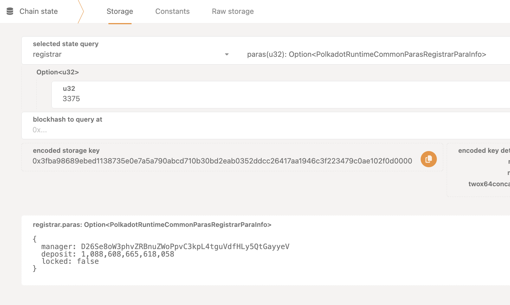

# Unlock your parachain

## Introduction

[RFC-14](https://github.com/polkadot-fellows/RFCs/blob/main/text/0014-improve-locking-mechanism-for-parachains.md) describes
the currently implemented locking mechanism for parachains and the motivation behind it.
If you parachain has produced a block, it will automatically be locked, preventing from being deregistered and the deposit being withdrawn.

## How to unlock

Unlocking a parachain is then allowed by sending an XCM call to the relay chain with the parachain origin (or executing the relay chain root call).
This guide explains how to send this message assuming your parachain has a `Sudo` pallet (and the `XCM` configuration/pallets) using Kusama as the relay chain.
If your parachain does not have a `Sudo` pallet, you will need to authorize sending this message via the governance mechanism that your parachain has.

## How to check if your parachain is locked



## Pre-requisites

First, you need to install `subxt-cli` and download the metadata of your parachain (specifying your parachain's RPC address):

```bash
cargo install subxt-cli
subxt metadata --url "<my-parachain-rpc-address>" > artifacts/my-parachain.scale
```

## Steps

1. As a first step you need to prefund the sovereign account of your parachain on the relay chain with some small amount to cover the XCM execution fee.
Normally, 0.1 KSM should be enough. We will provide an address on the relay chain to receive the surplus of the funds after XCM execution.

The script will print the address of the sovereign account of your parachain on the relay chain and terminate if the balance is zero.

```bash
cargo run -- --parachain-id <my-parachain-id> --refund-address "<my-refund-address>"
```

Example:

```
cargo run -- --parachain-id 3375 --refund-address "5CWUnKnvsgonAubk2CkTuSTv3TUaXQ5WT7nutgh7w646EeZv"
```

2. Once you prefunded the account, you can execute the script again and it should print you an encoded call you can sign with SUDO.
Executing this call should unlock your parachain.
